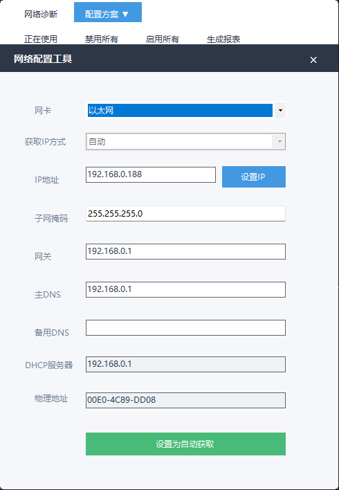
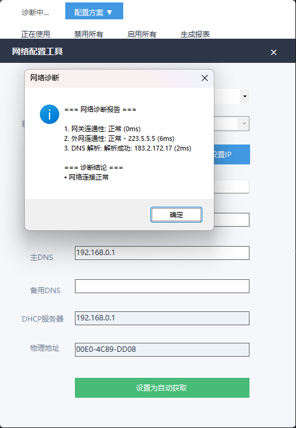
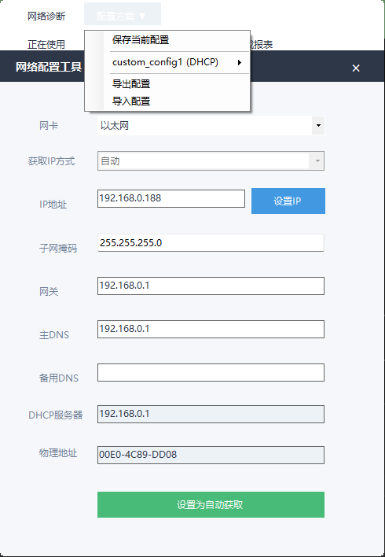
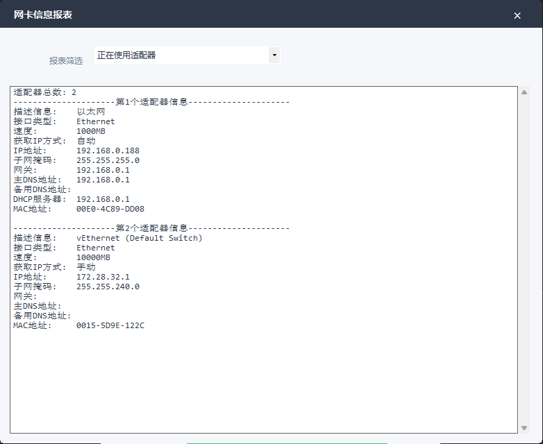

# IP Tool


## 简介

Windows 网络配置工具，用于查看和修改本机网络适配器的 IP 配置。

## 功能

### 基础功能
- 查看网卡信息（IP、子网掩码、网关、DNS、MAC 地址）
- 手动设置 IP 配置
- 一键切换 DHCP 自动获取
- 禁用/启用所有网络连接
- 生成网卡信息报表

### 高级功能
- **IP 配置方案管理** - 保存常用配置，一键切换（如：公司/家庭/测试环境）
- **网络连通性测试** - Ping 测试、DNS 解析测试、完整网络诊断
- **快速 DNS 切换** - 右键选择预设 DNS（114/阿里/腾讯/Google/Cloudflare）
- **配置导出/导入** - JSON 格式备份恢复，方便迁移

## 截图

### 主界面


### 网络诊断


### 配置方案


### 生成报表


## 技术栈

- 语言：C# (.NET Framework 4.8)
- 框架：Windows Forms
- 网络配置：WMI (Win32_NetworkAdapterConfiguration)

## 构建

```bash
msbuild IP_UpdateTest.sln /p:Configuration=Release
```

## 使用说明

1. 以管理员身份运行（修改网络配置需要管理员权限）
2. 选择网卡后可查看/修改 IP 配置
3. 右键点击 DNS 输入框可快速选择预设 DNS
4. 点击「配置方案」可保存/加载常用配置
5. 点击「网络诊断」可检测网络连通性

## License

MIT
