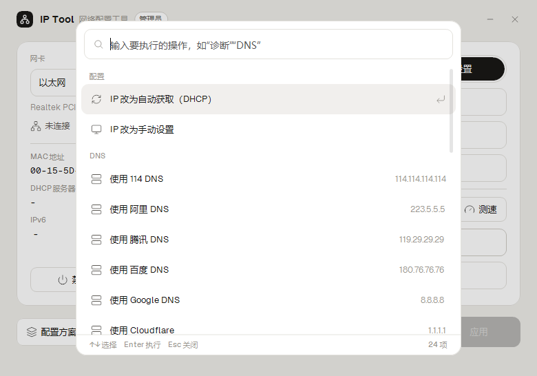
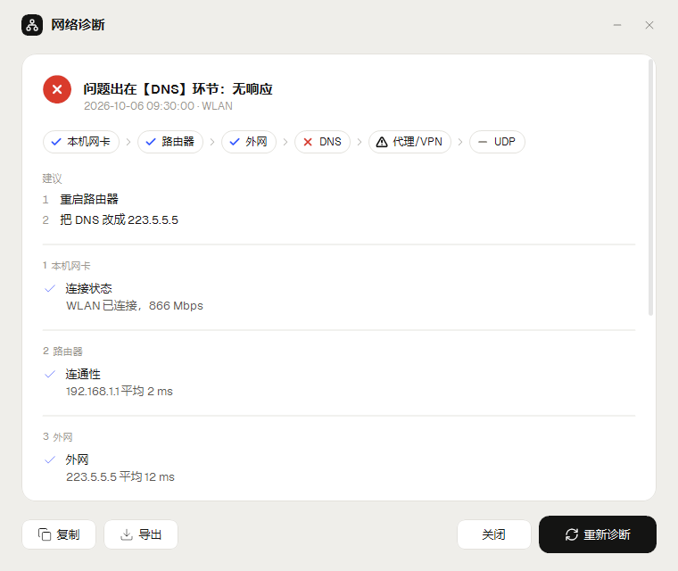

# IP Tool

[](https://github.com/kekemao00/ip-tool/releases/latest)
[](https://github.com/kekemao00/ip-tool/actions/workflows/build.yml)
[](LICENSE)


Windows 网络配置与诊断工具：一键切换网卡 IP / DNS 方案，分层诊断定位断网环节（网卡、路由器、DNS、代理/VPN、UDP），附 DNS 测速与命令行。


## 下载

在 [Releases](https://github.com/kekemao00/ip-tool/releases/latest) 下载 zip，解压后运行 `IPTool.exe`，无需安装。

- 需要 .NET Framework 4.8：Windows 10 1903 及以上、Windows 11 已自带
- 请把 `IPTool.exe.config` 和 exe 放在一起（其中有高 DPI 设置）
- 每个 Release 附有 `SHA256SUMS.txt`，可用于校验下载的文件

## 功能

### 网卡配置
- 查看网卡信息：IPv4、子网掩码、网关、DNS（区分自动 / 手动）、MAC、DHCP 服务器与租约、IPv6
- 静态 IP 与自动获取（DHCP）切换，支持 **DHCP + 手动 DNS**
- 输入即时校验：IP 格式、掩码是否连续、网关是否在同一网段、是否为网段或广播地址；可直接输入 `192.168.1.10/24`
- 应用前检测 IP 冲突（同网段 ARP 探测）；修改当前上网的网卡前再次确认
- 单个网卡启用 / 禁用；“更多”菜单中可启用或禁用列表中的所有网卡、续订 DHCP 租约
- 命令面板（Ctrl+K）：搜索并执行配置方案、DNS 预设、诊断等操作
- 网络变化时自动刷新；默认只列出物理网卡，勾选“显示全部”可查看虚拟网卡



### 配置方案
- 保存、编辑、复制、排序、删除配置方案，可绑定到指定网卡（按 MAC）
- 导入 / 导出 JSON（兼容旧版本导出的文件），导入时可选择覆盖或跳过同名方案
- 托盘菜单一键切换方案；可设置“关闭时最小化到托盘”“开机自动启动”


### 网络诊断与 DNS 测速
- 分层诊断：按“本机网卡 → 路由器 → 外网 → DNS → 代理/VPN → UDP”的顺序逐个环节检测，指出最先出问题的环节，并给出每一项的排查或处理建议；可复制或导出 TXT（附网卡信息）/ JSON
  - 本机网卡：连接状态、IP 是否为 169.254.x.x（DHCP 失败）、网关是否同网段、多个网卡都有默认网关、Wi-Fi 信号强度
  - 路由器：丢包与延迟（ping 不通时用 ARP 判断路由器是否在线）、双重 NAT（光猫 + 路由器）、运营商级 NAT（没有公网 IPv4）
  - 外网：ping、TCP、HTTP（直连，不经代理）分别检测，可识别禁 ping 网络和需要网页认证的网络；HTTPS 证书被替换；路径 MTU
  - DNS：各 DNS 服务器直接查询、系统解析、DNS 劫持（不存在的域名被解析）、hosts 自定义条目
  - 代理/VPN：系统代理、PAC、WinHTTP 代理、HTTP_PROXY 等环境变量是否可连接（代理软件退出后残留的系统代理是常见的“有网但打不开网页”原因）；代理是否真正可用；VPN / TUN 网卡与默认路由、Fake-IP（198.18.x.x）、正在运行的代理程序、国际网站可达性
  - UDP：公共 DNS（UDP 53）与 STUN（UDP 3478）是否有应答，识别 UDP 被封锁或只放行 DNS；根据 STUN 结果判断 NAT 类型（对称型 NAT 会影响 P2P 联机、游戏语音）
- DNS 测速：直接向各公共 DNS 发送查询（不经过系统缓存），按延迟排序后一键使用；可保存自定义 DNS 预设




### 报表
- 按“已连接 / 物理网卡 / 全部网卡”筛选，可复制或导出为 TXT / JSON


## 使用说明

- 普通权限启动即可查看；修改配置需要管理员权限，程序会提示以管理员身份重启，已填写的内容会自动带过去
- 未连接的网卡（未插网线、Wi-Fi 未连接）只能改为自动获取或修改 DNS：Windows 无法关闭未连接网卡的 DHCP，设置的静态 IP 不能可靠生效。请先插好网线或连接 Wi-Fi（对端没有 DHCP 服务也可以），再设置静态 IP
- Hyper-V 等由系统管理的虚拟网卡只能查看
- 按 Ctrl+K 打开命令面板，输入关键字（如“诊断”“DNS”或方案名）即可执行对应操作
- 配置方案和设置保存在 `%APPDATA%\IPTool\`

## 命令行

```
IPTool.exe --list [--json]
IPTool.exe --diagnose [--adapter <网卡>] [--json]
IPTool.exe --adapter <网卡> --static <IP>[/<前缀>] [--mask <掩码>] [--gateway <网关>] [--dns <DNS1>[,<DNS2>]]
IPTool.exe --adapter <网卡> --dhcp [--dns <DNS1>[,<DNS2>]]
IPTool.exe --adapter <网卡> --profile <配置方案名称>
IPTool.exe --adapter <网卡> --enable | --disable
```

- `<网卡>` 可以是连接名称（如 `以太网`、`WLAN`）、接口索引或网卡 GUID
- `--diagnose` 进行分层网络诊断，不指定网卡时诊断当前上网的网卡；不需要管理员权限，发现问题时退出码为 6
- `--static` 未指定 `--gateway` 时不设网关，未指定 `--dns` 时清空 DNS；`--dhcp` 未指定 `--dns` 时 DNS 也自动获取
- 非管理员运行时会请求提权；加 `--no-elevate` 则不提权，直接以退出码 5 结束
- 退出码：0 成功，1 参数错误，2 找不到网卡，3 配置无效，4 应用失败，5 需要管理员权限，6 诊断发现问题
- 本程序是窗口程序：在 cmd 中用 `start /wait` 运行才能拿到退出码，PowerShell 中可用 `Start-Process -Wait -PassThru`

```bat
start /wait IPTool.exe --adapter 以太网 --static 192.168.1.100/24 --gateway 192.168.1.1 --dns 223.5.5.5,119.29.29.29
start /wait IPTool.exe --adapter 以太网 --dhcp
IPTool.exe --diagnose > 诊断.txt
```

## 构建

只需要 [.NET SDK](https://dotnet.microsoft.com/download)（已用 10.0 验证），不需要安装 Visual Studio：

```bash
dotnet build IP_UpdateTest.sln -c Release   # 输出在 IP_UpdateTest/bin/Release/net48/
dotnet test IP_UpdateTest.sln
```

## 发布

推送到 main 后，GitHub Actions 会构建并运行测试；如果 `IP_UpdateTest/IP_UpdateTest.csproj` 中的 `<Version>` 还没有对应的 Release，会自动创建标签 `v<版本号>` 并发布 Release（附 zip 和 SHA256SUMS.txt）。版本号不变时只构建，不发布。

发布新版本：

1. 修改 `IP_UpdateTest/IP_UpdateTest.csproj` 中的 `<Version>`
2. 在 `CHANGELOG.md` 中添加对应版本的小节（如 `## v2.0.1`），内容会作为 Release 说明
3. 提交并推送到 main

## 技术栈

- C# / .NET Framework 4.8 / Windows Forms（SDK 风格项目）
- 网卡信息：`System.Net.NetworkInformation`、WMI `MSFT_NetAdapter`
- 修改配置：WMI `Win32_NetworkAdapterConfiguration`；未连接网卡和清除网关使用 `netsh`

## License

本项目基于 [Apache License 2.0](LICENSE) 开源。
