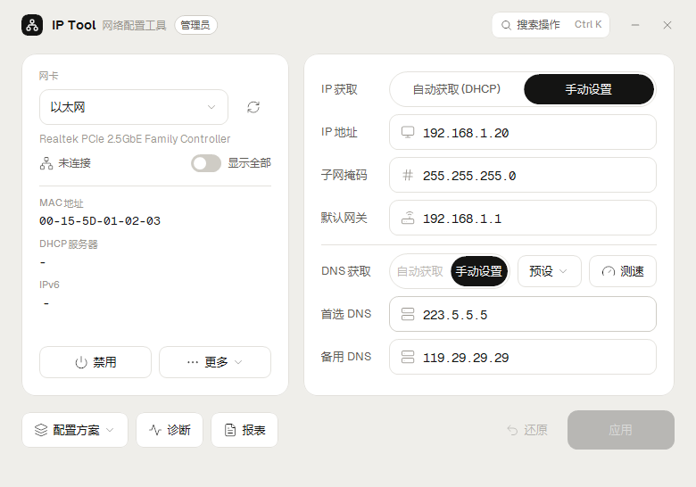
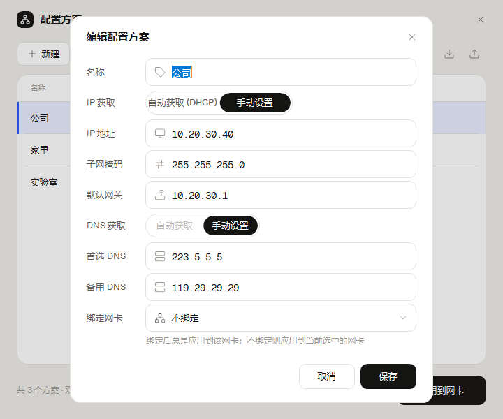
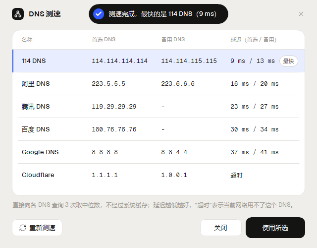
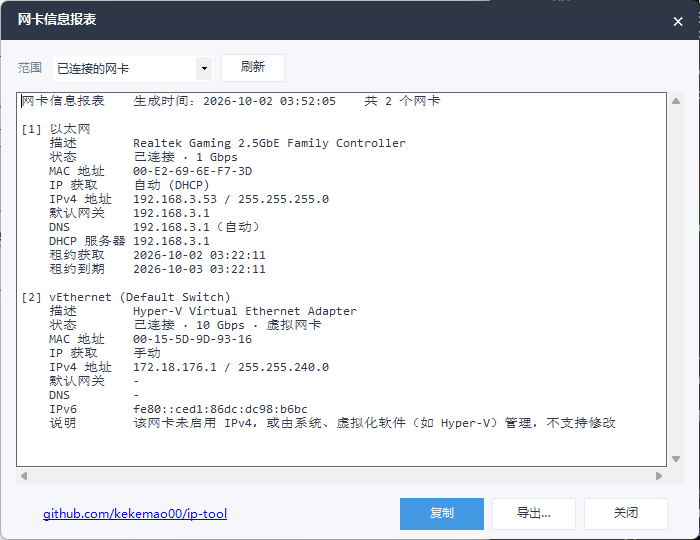

# IP Tool


## 简介

Windows 网络配置工具：查看和修改网卡的 IPv4 配置（IP、子网掩码、网关、DNS），一键切换常用配置方案，并提供网络诊断与 DNS 测速。



## 功能

### 网卡配置
- 查看网卡信息：IPv4、子网掩码、网关、DNS（区分自动 / 手动）、MAC、DHCP 服务器与租约、IPv6
- 静态 IP 与自动获取（DHCP）切换，支持 **DHCP + 手动 DNS**
- 输入即时校验：IP 格式、掩码是否连续、网关是否在同一网段、是否为网段或广播地址；可直接输入 `192.168.1.10/24`
- 应用前检测 IP 冲突（同网段 ARP 探测）；修改当前上网的网卡前再次确认
- 单个网卡启用 / 禁用；“更多”菜单中可启用或禁用列表中的所有网卡、续订 DHCP 租约
- 网络变化时自动刷新；默认只列出物理网卡，勾选“显示全部”可查看虚拟网卡

### 配置方案
- 保存、编辑、复制、排序、删除配置方案，可绑定到指定网卡（按 MAC）
- 导入 / 导出 JSON（兼容旧版本导出的文件），导入时可选择覆盖或跳过同名方案
- 托盘菜单一键切换方案；可设置“关闭时最小化到托盘”“开机自动启动”



### 网络诊断与 DNS 测速
- 诊断：网关、外网（Windows NCSI 连通性检测，ping 兜底，可识别需要网页认证的网络）、各 DNS 服务器、域名解析，最后给出结论
- DNS 测速：直接向各公共 DNS 发送查询（不经过系统缓存），按延迟排序后一键使用；可保存自定义 DNS 预设



诊断结果示例：

```
✓ 网卡：以太网 · 已连接 · 1 Gbps
✓ 网关：192.168.3.1 延迟 0 ms
✓ 外网：正常（HTTP 532 ms）
✓ DNS 192.168.3.1：响应 4 ms
✓ 域名解析：www.baidu.com → 183.2.172.177（5 ms）

结论：网络连接正常
```

### 报表
- 按“已连接 / 物理网卡 / 全部网卡”筛选，可复制或导出为 TXT / JSON



## 使用说明

- 普通权限启动即可查看；修改配置需要管理员权限，程序会提示以管理员身份重启，已填写的内容会自动带过去
- 未连接的网卡（未插网线、Wi-Fi 未连接）只能改为自动获取或修改 DNS：Windows 无法关闭未连接网卡的 DHCP，设置的静态 IP 不能可靠生效。请先插好网线或连接 Wi-Fi（对端没有 DHCP 服务也可以），再设置静态 IP
- Hyper-V 等由系统管理的虚拟网卡只能查看
- 配置方案和设置保存在 `%APPDATA%\IPTool\`

## 命令行

```
IP_UpdateTest.exe --list [--json]
IP_UpdateTest.exe --adapter <网卡> --static <IP>[/<前缀>] [--mask <掩码>] [--gateway <网关>] [--dns <DNS1>[,<DNS2>]]
IP_UpdateTest.exe --adapter <网卡> --dhcp [--dns <DNS1>[,<DNS2>]]
IP_UpdateTest.exe --adapter <网卡> --profile <配置方案名称>
IP_UpdateTest.exe --adapter <网卡> --enable | --disable
```

- `<网卡>` 可以是连接名称（如 `以太网`、`WLAN`）、接口索引或网卡 GUID
- `--static` 未指定 `--gateway` 时不设网关，未指定 `--dns` 时清空 DNS；`--dhcp` 未指定 `--dns` 时 DNS 也自动获取
- 非管理员运行时会请求提权；加 `--no-elevate` 则不提权，直接以退出码 5 结束
- 退出码：0 成功，1 参数错误，2 找不到网卡，3 配置无效，4 应用失败，5 需要管理员权限
- 本程序是窗口程序：在 cmd 中用 `start /wait` 运行才能拿到退出码，PowerShell 中可用 `Start-Process -Wait -PassThru`

```bat
start /wait IP_UpdateTest.exe --adapter 以太网 --static 192.168.1.100/24 --gateway 192.168.1.1 --dns 223.5.5.5,119.29.29.29
start /wait IP_UpdateTest.exe --adapter 以太网 --dhcp
```

## 运行环境

- .NET Framework 4.8：Windows 10 1903 及以上、Windows 11 已自带
- 发布后可在 [Releases](https://github.com/kekemao00/ip-tool/releases) 下载 zip，解压后运行 `IP_UpdateTest.exe`（`IP_UpdateTest.exe.config` 中有高 DPI 设置，请放在一起）

## 构建

只需要 [.NET SDK](https://dotnet.microsoft.com/download)（已用 10.0 验证），不需要安装 Visual Studio：

```bash
dotnet build IP_UpdateTest.sln -c Release   # 输出在 IP_UpdateTest/bin/Release/net48/
dotnet test IP_UpdateTest.sln
```

推送 `v*` 标签时，GitHub Actions 会自动构建、测试并发布 Release。

## 技术栈

- C# / .NET Framework 4.8 / Windows Forms（SDK 风格项目）
- 网卡信息：`System.Net.NetworkInformation`、WMI `MSFT_NetAdapter`
- 修改配置：WMI `Win32_NetworkAdapterConfiguration`；未连接网卡和清除网关使用 `netsh`

## License

MIT
